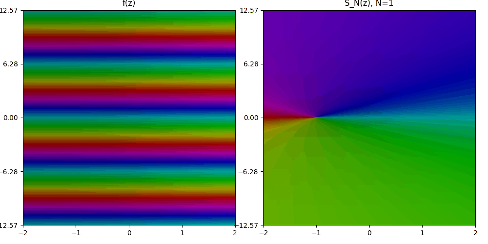
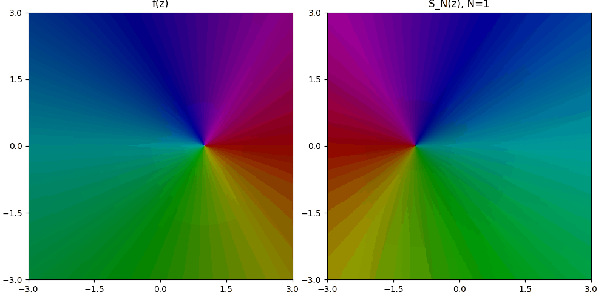

### Series de Taylor

**Teorema.** Supongamos que una función $f$ es analítica en todo un disco $|z-z_0|<R$, centrado en $z_0$ con radio $R$. Entonces $f(z)$ tiene la representación en serie de potencias

$$
f(z) = \sum_{n=0}^{\infty} a_n (z-z_0)^n, \quad |z-z_0| \lt R, \qquad (1)
$$

donde

$$
a_n = \frac{f^{(n)}(z_0)}{n!}, \quad n=0,1,2,\cdots \qquad (2)
$$

Es decir, la serie $(1)$ converge a $f(z)$ cuando $z$ se encuentra en el disco abierto indicado.

---

### Sobre este repositorio

Este repositorio contiene visualizaciones interactivas de series de Taylor utilizando técnicas de *domain coloring* que use para mostrarles a los estudiantes de Cálculo III (Cálculo complejo) para que comprendan mejor cómo convergen las aproximaciones en serie de potencias. Tener en cuenta que el dominio coloreado solo me habla del argumento y no del módulo.

Algunas animaciones son:

> $f(z) = e^z$, que converge para todo el plano complejo porque es una función analítica
> 
> 

> $f(z) = frac{1}{1-z}$, el desarrollo centrado en $z_0=0$, se realiza usando la serie geométrica, converge para el disco $|z|<1$
> 
> 

---

*--- Más figuras se pueden encontrar en la carpeta `figures` ---*
